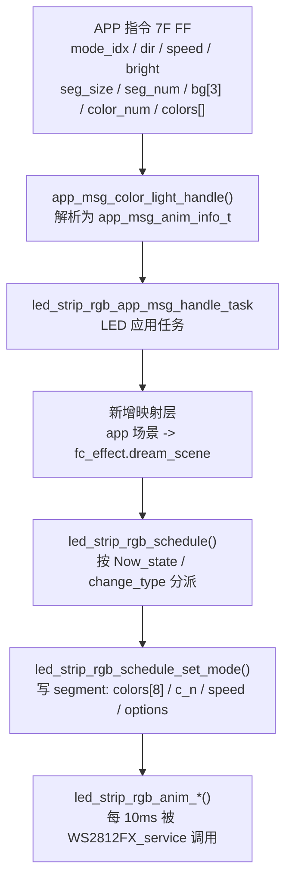

 

## 待修改功能点

- **`fc_effect` 不要替换**。它是"当前运行效果"的唯一真值，被 `rf24g_key.c`、`dp_data_tran.c`、`led_strip_sys.c`、`save_flash`、`led_strip_white_*` 等 8 个以上文件依赖，`led_strip_rgb_schedule()` 也是按 `fc_effect.Now_state` + `dream_scene.change_type` 分派的。换掉等于全工程重构。
- **但也不该让 app 任务直接怼 `fc_effect`**。建议加一个"语义场景结构体 + 映射函数"的中间层，把线上格式翻译成 `fc_effect` + `WS2812FX segment`。
- **子动画要改，但只有 4~6 处小改**，而且都是"口径统一"性质的，不是重写。

## 现有数据流




---

关键事实：**动画参数其实不是从 `fc_effect` 读的**，而是 `led_strip_rgb_schedule_set_mode()` 把它们灌进 WS2812FX 的 segment（`colors[8]` / `c_n` / `speed` / `options`），动画函数再读 `_seg`。`fc_effect` 只被动画函数直接读了 4 个字段：`dream_scene.seg_size`（3 处）、`fc_effect.b`、`fc_effect.app_speed`（`led_strip_rgb_anim_breathing` 里 1 处）、`fc_effect.mode_cycle`。

所以"新结构体"的真正落点只有两处：`fc_effect.dream_scene` 和 segment。

## 协议字段 → 现成落点对照

| 协议字段                 | 现成落点                                                       | 缺口                                                                                     |
| ------------------------ | -------------------------------------------------------------- | ---------------------------------------------------------------------------------------- |
| `mode_idx`（0x01~0x0C）  | `dream_scene.change_type`                                      | 索引体系不同（协议 0x01~0x0C vs 内部 2~32）→ **需要映射表**                              |
| `anim_dir` 0/1           | `dream_scene.direction` → handler 转 `options` 的 `REVERSE` 位 | 直接映射（0→`IS_forward`、1→`IS_back`）                                                  |
| `anim_speed` %           | `dream_scene.speed`（单位 ms，越大越慢）                       | **语义相反**，需换算；且 breathing 里另有一套                                            |
| `anim_brightness` %      | `app_b` / `b`                                                  | 复用，注意同时 `WS2812FX_setBrightness()`                                                |
| `seg_size`               | `dream_scene.seg_size`                                         | 只有 3 个动画函数用它；其他 handler 用 `options` 的 `SIZE_*`(1/3/5/7) → **两套机制冲突** |
| `seg_num`                | **无**                                                         | 需新增；多数动画把"段数"写死                                                             |
| `bg[3]`                  | **无独立字段**，约定"底色 = `colors[c_n-1]`"                   | 映射时追加到颜色池末位即可**零改动兼容**                                                 |
| `color_num` + `colors[]` | `dream_scene.c_n` + `rgb[8]`                                   | 协议允许 16，段/池只有 8 → 截断或扩容                                                    |

## 建议的三层方案

**1) 线上层**：`app_msg_anim_info_t` 不动，只补校验。

**2) 语义层（新增）**：只描述"app 想要的效果状态"，便于持久化、回读、判重、上报：

```c
typedef struct {
    u8  mode_idx;        // 协议模式索引
    u8  dir;             // 0 正 / 1 反
    u8  speed_percent;   // 0~100
    u8  bright_percent;  // 0~100
    u8  seg_size;        // 每组灯数
    u8  seg_num;         // 段数
    color_t bg;          // 底色
    u8  color_num;
    color_t colors[APP_MSG_COLOR_NUM_MAX];
} led_strip_rgb_app_scene_t;
```

**3) 运行层**：`fc_effect` + segment，**完全不变**。

映射函数 `led_strip_rgb_apply_app_scene(const led_strip_rgb_app_scene_t *s)` 做 5 件事：

1. **模式映射表**（照 `app_msg_cmd_table` 的表驱动写法）：
```c
typedef struct {
    app_msg_mod_idx_t mode_idx;
    change_type_e     change_type;
    u8                flags;   // USE_BG / USE_SEG_NUM / IS_STATIC
} app_mode_map_t;
```
2. **速度换算**：直接复用 `led_strip_rgb_set_speed()` 的算法（`500 - 500*pct/100`，再钳 `get_max_speed()`），别写第二份。
3. **亮度**：`app_b`/`b` + `WS2812FX_setBrightness()`。
4. **段大小**：`dream_scene.seg_size = seg_size ? seg_size : 1`，并让 handler **不再传 `SIZE_MEDIUM`**，改由 `seg_size` 派生。
5. **颜色池**：`c_n = color_num (+1 若用底色)`，底色放**末位**，整体 `memcpy` 进 `dream_scene.rgb`，然后 `Now_state = IS_light_scene; led_strip_rgb_schedule();`

**为什么选"底色追加到末位"**：既有动画（`led_strip_rgb_anim_background_meteor`、`..._single_superposition_with_background`、`..._multi_dot_running`、流星雨/星空/星云）已经按 `_seg->colors[_seg->c_n - 1]` 取底色。而且旧 DP 协议就是这么传的 —— 见 `dp_data_tran.c` 的 `DPID_RGBIC_LINERLIGHT_SCENE`：`mode=buff[4]`、`dir=buff[5]`、`seg_size=buff[6]`、`c_n=buff[7]`、`colors=buff[8..]`；`38 00 00 ... 1F 00 05 02 FF 00 00 FF FF FF`（白底红色堆积）的最后一个颜色正是 `FF FF FF`。**走这条路径，动画本体零改动。**

## 子动画需要改的具体点

1. `led_strip_rgb_anim_mutil_fade`、`led_strip_rgb_anim_single_block_scan`、`led_strip_rgb_anim_mutil_breath`：`fc_effect.dream_scene.seg_size` 的读取点要收敛成统一入口（用 `_seg` 携带的 size 或统一 getter），**与 `options` 的 `SIZE_*` 二选一**，消除两套"段大小"。
2. `led_strip_rgb_anim_breathing`：内部又用 `fc_effect.app_speed` 算了一套速度 → 改成 `_seg->speed`，否则呼吸模式会有两套速度行为。
3. `_seg->c_n` 作模数 / `colors[c_n-1]` 的地方补钳位（部分需 `c_n >= 2`，`led_strip_rgb_anim_breath` 用了 `colors[1]`），防协议 `color_num=0/1` 时除零/越界。
4. 颜色上限：`MAX_NUM_COLORS = 8` vs `APP_MSG_COLOR_NUM_MAX = 16`。6 灯产品建议在映射层截断到 7(+1底色)，不建议扩 Segment（10 段 × 32B RAM）。
5. **唯一可能真动动画本体的**：`seg_num`。星空/星云/流星雨/跑动/堆积 的块大小/密度目前是写死的（`SIZE_MEDIUM`、`_seg_len/3` 等）。要真正按协议"段数"跑，得把 `seg_num` 传进去当分组数；否则先只做校验（`seg_size * seg_num <= led_num`），忽略它。
6. 顺手修的：`led_strip_rgb_app_msg_handle_task` 现在**没判消息类型**就无条件走 anim 分支（应判 `USER_THREAD_COMM_MSG_TYPE_APP_MSG_ANIM_INFO_UPDATE`），且 `user_data_save_enable()` 无条件调用。

## 两个必须跟 APP 端确认的歧义

- **开幕 / 闭幕共用一个 `mode_idx = 0x0B`**，协议里只有一个 `anim_dir`，无法区分开/关。需要 APP 端给出区分方式（不同 mode_idx？还是当作一个循环？）。
- **星空 vs 星云、流星 vs 流星雨** 的差别在协议里只体现在"有没有底色"，需要用 `bg` 是否为 0（或 `flags`）来分派，不能只看 `mode_idx`。
- 另外文档里的 `38 00 00` 系列（`0x02/0x0A/0x0B/0x0D/0x14...`）与顶部"模式索引表"（`0x01~0x0C`）是**两套编码**，部分条目的 length 字节也对不上（如五段七彩呼吸、星云）。映射表要按 APP 最终确认的那一套来写。渐变/过渡指令的 dir 字节还出现了 `0x16`/`0x14`，建议解析时**按位取 bit4**，别做枚举全等比较。

## 风险提醒

- 写 segment 与 10 ms `WS2812FX_service()` 存在竞态：映射/重配置建议只在 LED 任务里做（沿用现在"消息投递到任务"的模式），必要时用临界区包住 `led_strip_rgb_schedule_set_mode()`。
- 动画函数会**原地旋转** `_seg->colors`（`memmove`），所以每次重下发必须从语义层完整重灌颜色池，否则颜色会漂。
- 重发同一条指令要做去抖，否则每次都 `WS2812FX_resetSegmentRuntime()` 会重启动画。

需要我按这个方案落地吗？我可以先做最小闭环：新增 `led_strip_rgb_app_scene_t` + 模式映射表 + `led_strip_rgb_apply_app_scene()`，并顺手改上面第 1~3、6 项，`seg_num` 先只做校验。